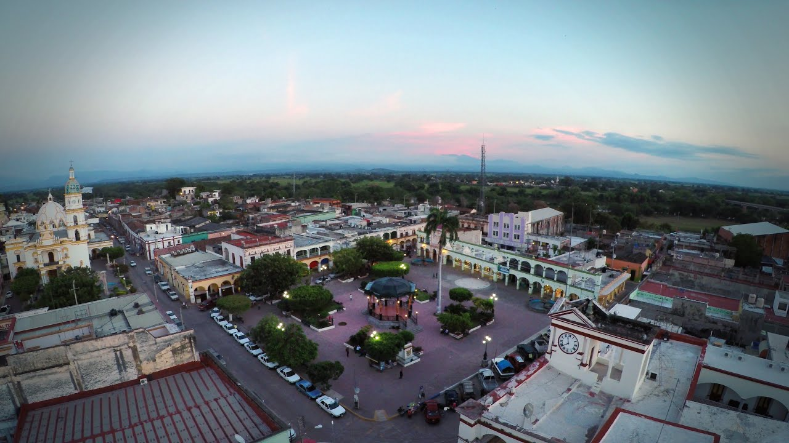
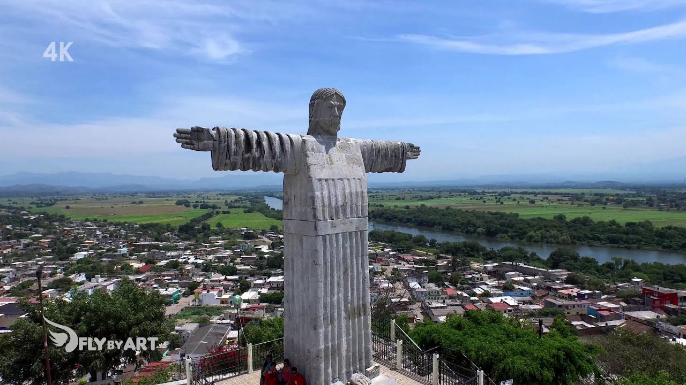

<html lang="es">

<body>
    <header>
        <h1>Dónde Nací??</h1>
        
Un vistazo a mi ranchito natal<3

    </header>
    <section class="main-content">
        
<a href="https://www.google.com/maps/place/Santiago+Ixcuintla,+Nay./@21.8139614,-105.2477964,13z/data=!3m1!4b1!4m6!3m5!1s0x8420a8b2824a9843:0xc22112d053302bda!8m2!3d21.8131863!4d-105.204327!16s%2Fg%2F11c264st4t?entry=ttu&g_ep=EgoyMDI1MDMxMC4wIKXMDSoASAFQAw%3D%3D"><h2>Santiago Ixcuintla</h2></a>

        
Yo nací en Santiago Ixcuintla, viví 9 o 10 años allí. Lo único que extraño de Santiago era que vivía enfrente de una unidad deportiva, lo cual me permitió disfrutar de muchas actividades al aire libre. Después de la primaria, salía a jugar y entrenaba varios deportes como el fútbol, béisbol y box. Fueron años muy especiales que siempre recordaré con cariño.

        
Santiago Ixcuintla es un lugar lleno de historia y tradiciones, y siempre será un pedazo de mi corazón. Aquí viví momentos únicos que me marcaron y ayudaron a formar la persona que soy hoy.

        <h3>Esto es Santiago Ixcuintla:</h3>
        <ul>
            <marquee direction="left">
                 
                
                
            </marquee> 
        </ul>
    </section>
</body>
</html>
